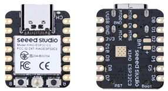

# Locomotive Decoder

This page describes how to build an RCC Locomotive Decoder and how to use one.

RCC decoder is built out of just two components - a motherboard and a CPU (yep, your decoder will have a motherboard and a CPU, like a grown up computer). You would need to order your own motherboards (how cool is that!). Then buy and solder CPUs. Finally, connect the motor, speaker, lights and other things your loco may have to the decoder and you are good to go.

Here is more detailed steps with links to even more step-by-step instructions:
1. There are a couple options for technology stack selection. You may read about them in **CPU Selection** section below. As of now only the first one - Simple (WiThrottle) is supported. The others will come later. For the selected one buy a couple CPU modules.
2. Download the latest release of RCC from #here#.
3. Order motherboards for your decoders. Step-by-step instructions are on ths [fabrication](fabrication) page. 
4. Solder the CPU to the motherboard. Here is that scary word - solder. But fear not, it is fairly simple process and I’ll provide instructions and videos here (_coming soon_).
5. Upload software to the final decoder, the details about how to do that is on the [upload](UPLOAD.md) page.
6. Right after the software upload the decoder starts as a WiFi access point with the name “RCC_Loco” and the same password. You may keep it this way, especially if you plan to use an old phone or a tablet that is always connected to this WiFi and you don’t need internet access on this phone/tablet. Alternatively, you may connect your decoder to your home WiFi. In such case you may use your main phone, as it would be connected to the internet as well as to a decoder. More details are on the [First Setup](FIRST_SETUP.md)
7. Your decoder is ready to be placed in a locomotive. Go ahead and do that, more details about how to connect all the wires are on the [Install](INSTALL.md) page.
8. Get a Throttle app on your mobile device - "Engine Driver" for Android or "WiThrottle" for iPhone. Any other app that supports WiThrottle protocol will do too.
9. Start the app, connect to your locomotive decoder, enjoy!

**Decoder Specs**
Power Supply: battery 7v to 24v.
Power: RCC decoder can drive a motor of up to 3 Amp.
Functions: RCC decoder can control up to 6 external functions like lights, smoke units or similar.
Sound: coming soon motherboard is capable of playing sounds, software support will be available soon.
Price: this is one of the best parts. Five fully assembled boards would cost you $60 (plus shipping, say $20). So, it is about $16 per board. The CPU is $10 per unit. So, you can get a fully functional decoder with sound and everything for under $30, shipping and taxes included! Nothing this powerful is remotely this affordable.

## CPU Selection
RCC Decoder is based on the Seeed Studio Xiao modules, you can read more about them [here](https://www.seeedstudio.com/xiao-series-page). These are really tiny micro computers, size of your thumb nail. RCC supports several variants of them with WiFi or BLE connectivity. Which one you need depends on how complicated you want your setup to be. Following sections provide details for each, below are the pictures of the CPU (the Xiao module).

### Simple (WiThrottle)
If you are not sure which option to choose, choose this one. This is the best choice if you want to run just a couple locomotives, usually one at a time and you want to keep everything really simple. You may have heard about JMRI or DCC-EX but you don't know what it is and you don't want to know. You just want to have fun. What you would need is the RCC Decoder and a phone or a tablet as a Throttle. Recommended CPU for this setup is Xiao ESP32C3, you can get one from [Seed Studio](https://wiki.seeedstudio.com/XIAO_ESP32C3_Getting_Started/) or [Amazon](https://www.amazon.com/Seeed-Studio-XIAO-ESP32C3-Microcontroller/dp/B0B94JZ2YF/ref=asc_df_B0B94JZ2YF?mcid=72b6a39f01243f90839a6151057a3d9f&hvocijid=9306890703710665590-B0B94JZ2YF-&hvexpln=73&tag=hyprod-20&linkCode=df0&hvadid=721245378154&hvpos=&hvnetw=g&hvrand=9306890703710665590&hvpone=&hvptwo=&hvqmt=&hvdev=c&hvdvcmdl=&hvlocint=&hvlocphy=1013950&hvtargid=pla-2281435178138&th=1). Actually any of Xiao ESP32 boards will do - C3, C6, S3. The C3 is the cheapest and it works just fine. The good part about this choice is flexibility. If you would decide to go complicated, run many trains, control turnouts and such - you would only need to update the software, the hardware can still be the same hardware.

### Complex (MQTT)
This is more complicated setup. You may still use a phone or a tablet as a Throttle, and you'd be able to run many locomotives at the same time. The complexity comes from a Central Station. You would need to build one and install JMRI. More details on how to do so is on the RCC Station page (_coming soon_). The CPU selection for this option is the same as above, Xiao ESP32C3.

### Flexible (NRF)
This is the most complicated option and it provides the most versatility. It may work with or without a command station, it doesn't need WiFi. But it does require a hardware Throttle. How to build one is explained on the RCC Throttle page (_still under construction_). I’m using this setup to control my live steam locomotives. I run them at home and I also meet with my fellow live steamers at various events. This option allows me to do both without any changes or complications.
