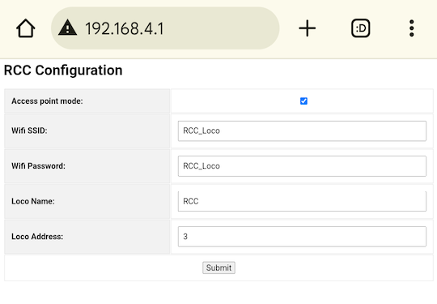

# First Setup

1. Using your phone, tablet or computer go to _RCC_Loco_ WiFi. Password is also _RCC_Loco_.
2. Open browser and go to http://192.168.4.1
3. Here is what you’d see:

5. Chose if you want to run your decoder on its own WiFi, or to be connected to your home network:
   - If you want the decoder to have its own WiFi, to be an access point, keep the Access Point Mode checkbox marked. You may change WiFi name (WiFi SSID) and password if you want to. If you do change it you’d need to reconnect your phone/tablet/computer to the new one after you are done. This mode is good if your layout is outside of your home WiFi. The only downside is your phone/tablet/computer will not have internet access while it is connected to this WiFi. Might be a good idea to use an old device just as a throttle (always connected to this WiFi only). 
   - You may connect your decoder to your home network. For then unmark the checkbox, provide your home WiFi SSID and password. Just make sure you are connecting to the WiFi of 2.4GHz. The 5GHz one is not supported.
6. The Loco Name and Address is a DCC-like name and address to identify your loco in the app. Default name is RCC and address is 3. If you put an address bigger than 127 it will show in your WiThrottle app as a Long address. Smaller numbers will be shown as Short.
7. Hit Submit and then power cycle the decoder.

Now you can go to your _Engine Driver_/_WiThrottle_. Make sure your phone/tablet is connected to the same WiFi you have set up on the step 4 above. You should see the same name you have used on step 5 above as an available WiThrottle server in the app. Click on it. Now you need to select your locomotive in the app, the same way you’d do that if you use DCC or JMRI or any other solution. To do so type the address (whatever was provided in the step 5 above) or just select the locomotive from the roster. Here you go - you are ready to control the decoder.

Essentially the decoder runs WiThrottle server. WiThrottle is designed to run on a control station and manage multiple locomotives. In RCC it is a little bit reduced. It only manages one locomotive. In this setup you’d be able to control multiple locomotives, but switch between them you’d need to go all the way to the first screen of the app and select another WiThrottle server. Unfortunately, this limitation would not allow you to put several locomotives on the same screen of the app. Such possibility will come with Compex setup later (see [CPU Selection](cpu_selection.md) for details/plans)). If you indeed want to run multiple locomotives at the same time make sure each locomotive has a unique name (provided on step 5).
