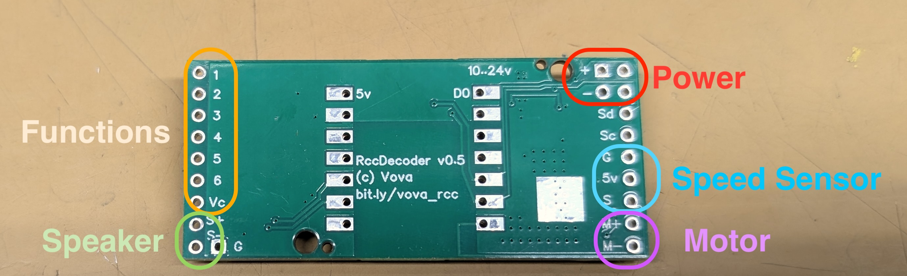

# Install

At this point you should have your decoder ready to be installed in the locomotive, you got your motheboards fabricated, CPU soldered and the software uploaded. This step is trivial - figure what wires on your locomotive are connected to motor, smoke unit, lights and such and connect them to the decoder. If you connected some other decoders (DCC or radio) before - you know what to do.

If you ordered your motheboard with screw terminals, grab a screwdriver and just connect the right wires. I preffer to use this dupont connectors instead. Here is an example of [the connectors with the crimping tool](https://www.amazon.com/Taiss-Ratcheting-Connector-Crimping-Terminal/dp/B0B11RLGDZ/ref=pd_vtp_strm_strm_cts_d_sccl_3_2/147-2764063-4966066?pd_rd_r=4351a99f-5e8e-4027-a5b0-dccba2810ab7&pd_rd_wg=662SQ&pd_rd_w=DMjg5&pd_rd_i=B0B11RLGDZ&psc=1). I solder the pins to the motherboard and plug/unplug things when I need to. 

Each motherboard terminal has a markings on the back:

Left side:
 * 1 to 6: functions to control lights, smoke unit or similar thing. Connect one wire to the function and another to the Vc connector below.
   * Function 5 is high load one, it can do 1Amp, other fucntions are 0.5Amp.
   * Function 6 has a pull up resistor (I'll provide details and reasons at some point later).
 * S+ and S-: for the speaker "+" and "-" terminals

Right side:
 * Power (+ and -): connect batatry "+" and "-" terminals here. Battery voltage can be anything between 7V and 24V.
 * Speed Sensor: Ground, +5V and Signal to connect optical (or Hall) sensor to measure locomotive speed. This is optional, more details will come later.
 * Motor: M+ and M- terminals for the locomotive motor. It is not really critical which one is "+" and which is "-". Nothing will burn if you connect them wrong, just locomotive will go reverse when the Throttle says forward. If this happens - just swap the "+" and "-" connections.
 
