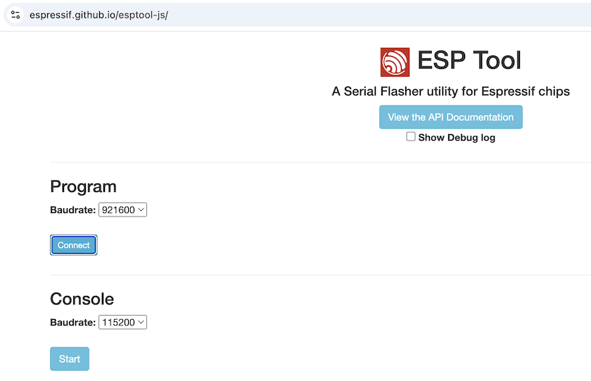
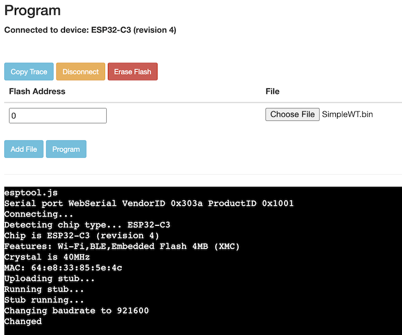
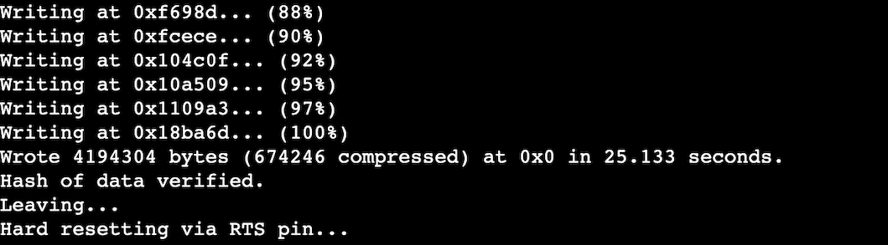

# Upload

Here is how to upload software to your new decoder. By this moment you should have your motherboard fabricated and CPU soldered - all ready to be turned alive. Actually you may upload software before you solder. The order of these two is unimportant.

1. Prepare software file from the release you downloaded before - Software_RccDecoder_SimpleWT.bin (there will be more options for software packages later).
2. Go to [epstool](https://espressif.github.io/esptool-js/). This is the thing that uploads software from your computer to the decoder CPU.
3. Click on **Connect**. It will show you a popup with the list of serial ports on your computer, remember them (or write the names down). Click Cancel for now.
4. Now, connect your CPU/decoder to your computer using USB-C cable. Click **Connect** again. Now the list would be one record longer - the new guy is what you need to select, this is your CPU/decoder. Once you do select it the screen changes a little and it is ready to get your software file.
   - If you don't see a new line in the list you likely have a bad USB cable. Some of them (especially very thin ones) are for charging only, they don't do data.
   - If you are confident in your cable, try to click the RESET button on the board while it is connected to the computer. Also try to refresh the esp tool page. 
6. Click **Choose File**, give it the Software_RccDecoder_xxx.bin.
7. **Important** In the Flash Address field, where it says "0x1000" - put "0" (zero).
8. Click **Program**. It takes a couple seconds for the thing to work, it will go all the way to 100%. Then it would say "Leaving..." and something about reset.
9. Now click a RESET button on the CPU module.
10. At this point you are done, you may progress to the [First Setup](first_setup.md).

### Starting screen (step 2):

### Ready to upload (step 8):

### Done (after step 8):

